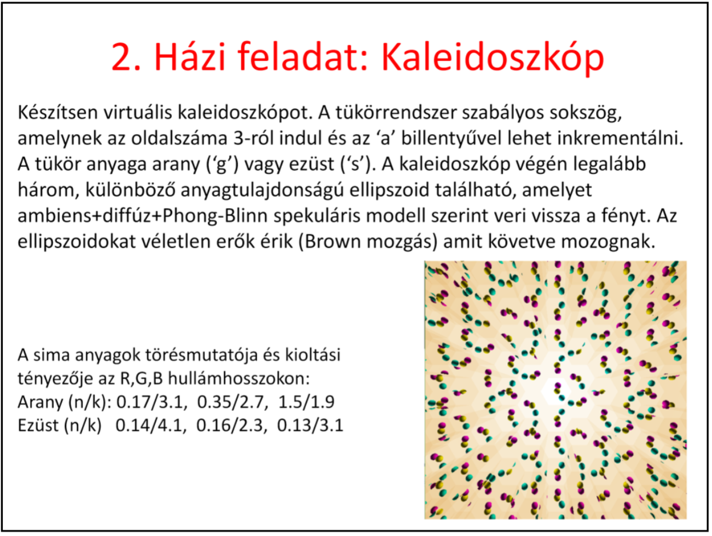
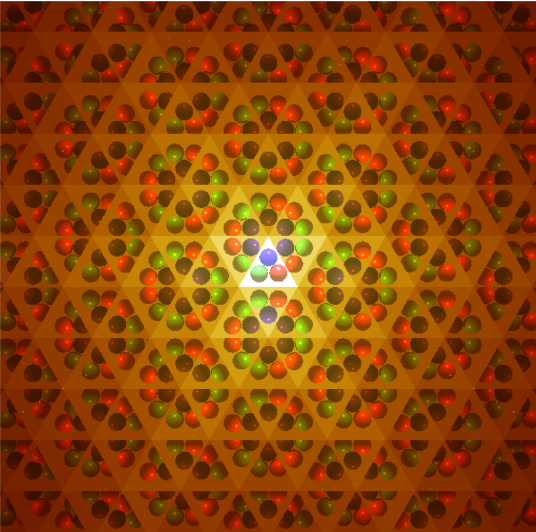
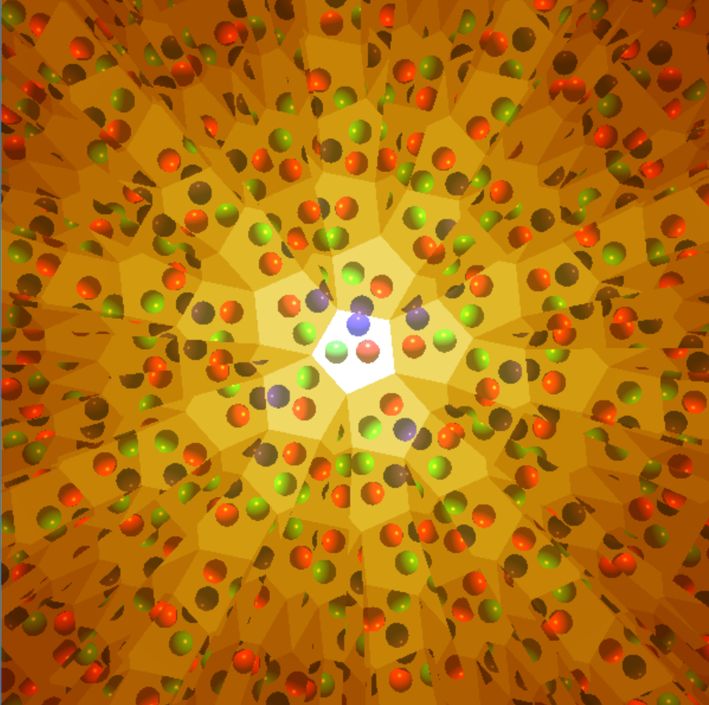
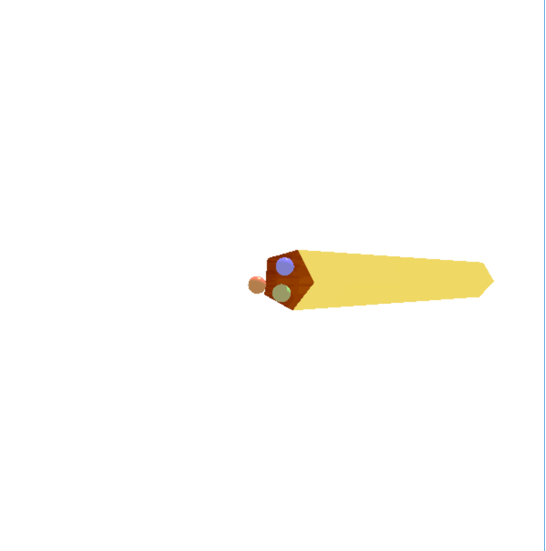
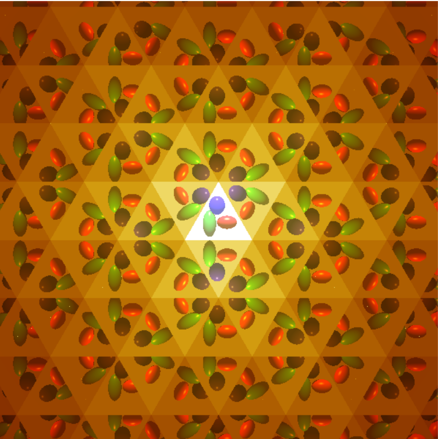

# grafika-hf2

2019 tavaszi félév, Számítógépes grafika tárgyhoz tartozó második házifeladat megoldásom.

### Futtatás
Windows10, Visual studio-ban: A runtime_environment letöltése, kicsomagolása, majd a /Programs/Skeleton/Skeleton-ban a Skeleton.cpp felülírása a repóban találhatóval, és utána a solutiont megnyitva hiba nélkül fordul.

Más oprendszer vagy más IDE-ben: god knows... ( a runtime environment-ben lévő freeglut és glew-1.13.0 mappákra mindenképpen szükség van)

### Feladatkiírás

#### Screenshots

Gömbök a tükörrendszerben:

Máshonnan nézve: 

Ellipszoidok a tükörrendszerben:

